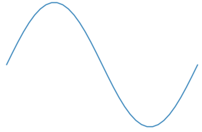

Setup:
```python
%matplotlib inline
import matplotlib.pyplot as plt
import numpy as np
import scipy

#### 1. Graphing helper function
def setup_graph(title='', x_label='', y_label='', fig_size=None):
    fig = plt.figure()
    if fig_size != None:
        fig.set_size_inches(fig_size[0], fig_size[1])
    ax = fig.add_subplot(111)
    ax.set_title(title)
    ax.set_xlabel(x_label)
    ax.set_ylabel(y_label)
```

#### 2. What does np.linspace() do?
```python
t = np.linspace(0, 4, 5)
print t
```

#### 3. What does np.sin() do?
```python
t = np.linspace(0, 10, 15)

signal = [np.sin(i) for i in t] 

plt.plot(t,signal)
```

#### 4. What does the np prefix refer to?

#### 5. Adjust t until you get a complete sine wave, e.g.:


#### 6. What is the difference between a sine wave and a cosine wave?

Examine: https://commons.wikimedia.org/wiki/File:Circle_cos_sin.gif

#### 7. What is amplitude and frequency? Make a sine wave with an amplitude=2 and a frequency double what we had before.

#### 8. Lets convert everything to seconds:
```python
freq = 10 #hz - cycles per second
amplitude = 3
time_to_plot = 2 # second
sample_rate = 100 # samples per second
num_samples = sample_rate * time_to_plot

t = np.linspace(0, time_to_plot, num_samples)
signal = [amplitude * np.sin(freq * i * 2*np.pi) for i in t] # Explain the 2*pi
plt.plot(t,signal)
```


