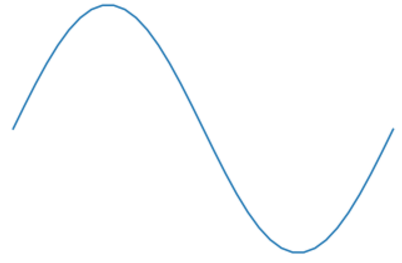

#### 1. Setup:

Open a CMD shell, and download latest git files:
```
cd c:\code\Team10182
git pull
```
Files are in c:\code\Team10182\DataScience. Look at the files in the audio_files sub-directory.

Then run 'jupyter notebook' and set it up:
```python
%matplotlib inline
import matplotlib.pyplot as plt
import numpy as np
import scipy

#### 1. Graphing helper function
def setup_graph(title='', x_label='', y_label='', fig_size=None):
    fig = plt.figure()
    if fig_size != None:
        fig.set_size_inches(fig_size[0], fig_size[1])
    ax = fig.add_subplot(111)
    ax.set_title(title)
    ax.set_xlabel(x_label)
    ax.set_ylabel(y_label)
```

#### 2. What does np.linspace() do?
```python
t = np.linspace(0, 4, 5)
print t
```

#### 3. What does np.sin() do?
```python
t = np.linspace(0, 10, 15)

signal = [np.sin(i) for i in t] 

plt.plot(t,signal)
```

#### 4. What does the np prefix refer to?

#### 5. Adjust t until you get a complete sine wave, e.g.:


#### 6. What is the difference between a sine wave and a cosine wave?

Examine: https://commons.wikimedia.org/wiki/File:Circle_cos_sin.gif

#### 7. What is amplitude and frequency? Make a sine wave with an amplitude=2 and a frequency double what we had before.

#### 8. Wave Convolution
```python
# Two subplots, the axes array is 1-d
x = np.linspace(0, 2 * np.pi, 100)
y1 = 5 * np.sin(x)
y2 = 0 * np.sin(2*x)
y3 = 3 * np.sin(3*x)
y4 = 2 * np.sin(4*x)
plt.plot(x,y1)
plt.plot(x,y2)
plt.plot(x,y3)
plt.plot(x,y4)
```
Identify which lines on the plot are y1, y2, y3, and y4.

```python
setup_graph(x_label='time', y_label='amplitude', title='y1+y2+y3+y4', fig_size=(12,6))
convoluted_wave = y1 + y2 + y3 + y4
_ = plt.plot(x, convoluted_wave)
```
What is setup_graph? Where was it defined?

Make 2 waves that cancel each other out. This is called Wave interference. This is how noise-cancellation head-phones work.


#### 9. Additive Waves

Square Wave:

https://en.wikipedia.org/wiki/Square_wave

Sawtooth Wave:

https://en.wikipedia.org/wiki/Sawtooth_wave


#### 8. Lets convert everything to seconds:
```python
freq = 10 #hz - cycles per second
amplitude = 3
time_to_plot = 2 # second
sample_rate = 100 # samples per second
num_samples = sample_rate * time_to_plot

t = np.linspace(0, time_to_plot, num_samples)
signal = [amplitude * np.sin(freq * i * 2*np.pi) for i in t] # Explain the 2*pi
plt.plot(t,signal)
```

#### 9. What does Hz mean?

See: https://en.wikipedia.org/wiki/Hertz

Now lets make a 'pretty plot' with labels:

```python
setup_graph(x_label='time (in seconds)', y_label='amplitude', title='time domain')
plt.plot(t, signal)
```

Plot a sine wave with a frequency of 4 Hz.

Period = 1/Frequency


#### 10a. First look at Fourier Transform
```python
fft_output = np.fft.rfft(signal)
magnitude_only = [np.sqrt(i.real**2 + i.imag**2)/len(fft_output) for i in fft_output]
frequencies = [(i*1.0/num_samples)*sample_rate for i in range(num_samples//2+1)]

setup_graph(x_label='frequency (in Hz)', y_label='amplitude', title='frequency domain')
plt.plot(frequencies, magnitude_only, 'r')
```


#### 11. 
``` python
import scipy.io.wavfile

(sample_rate, input_signal) = scipy.io.wavfile.read("c:/code/Team10182/DataScience/audio_files/vowel_ah.wav")
print sample_rate, input_signal, len(input_signal)/sample_rate, 1./sample_rate
time_array = np.arange(0, len(input_signal)/sample_rate, 1./sample_rate)

setup_graph(title='Ah vowel sound', x_label='time (in seconds)', y_label='amplitude', fig_size=(14,7))
_ = plt.plot(time_array[0:4000], input_signal[0:4000])
```

#### 11a. Second look at Fourier Transform
```python
fft_output = np.fft.rfft(input_)
magnitude_only = [np.sqrt(i.real**2 + i.imag**2)/len(fft_output) for i in fft_output]
frequencies = [(i*1.0/num_samples)*sample_rate for i in range(num_samples//2+1)]

setup_graph(x_label='frequency (in Hz)', y_label='amplitude', title='frequency domain')
plt.plot(frequencies, magnitude_only, 'r')
```

Try other sounds


